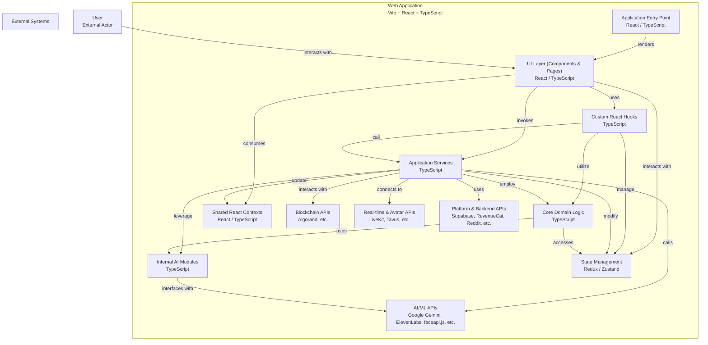

# <div align="center">NEXUS.DAWN 🌌</div>

<div align="center">

[](https://semver.org)
[](https://opensource.org/licenses/MIT)
[](http://makeapullrequest.com)
[](https://www.typescriptlang.org/)
[](https://reactjs.org/)
[](https://tailwindcss.com/)

[](https://nexus-dawn.vercel.app)
[](https://nexus-dawn-docs.vercel.app)

</div>

<div align="center">
  
</div>

## ✨ Overview

NEXUS.DAWN is a cosmic-scale emotional intelligence platform that combines AI, quantum computing metaphors, and immersive 3D interfaces. Experience the future of emotional intelligence through our innovative platform.

## 🚀 Quick Start

```bash
# Clone the repository
git clone https://github.com/your-username/NEXUS.DAWN.git

# Navigate to project directory
cd NEXUS.DAWN

# Install dependencies
npm install

# Start development server
npm run dev
```

## 🌟 Core Features

<details>
<summary><b>🎭 Emotional Intelligence Engine</b></summary>

- Real-time emotional resonance analysis
- Biofeedback interface for emotional tracking
- Personality evolution visualization
- Mood designer with neuropunk aesthetics
- Emotional timeline charting

</details>

<details>
<summary><b>⚛️ Quantum Interface</b></summary>

- Quantum timeline visualization
- Multiversal fork navigation
- Event horizon protocol for data management
- Quantum intuition pulse system
- Time-locked message management

</details>

<details>
<summary><b>🤖 AI Integration</b></summary>

- Advanced emotion processing engine
- LLM-powered narrative generation
- Personality shard analysis
- Cognitive fusion interface
- DAWN Voice synthesis

</details>

<details>
<summary><b>🎨 Immersive UI Components</b></summary>

- Cosmic compression engine
- Mind state mapping
- Memory viewer and composer
- Narrative interface
- Cosmic avatar system

</details>

<details>
<summary><b>⛓️ Blockchain Integration</b></summary>

- Wallet connectivity
- Secure transaction management
- Personality shard tokenization

</details>

## 🛠️ Technical Stack

<div align="center">

| Category | Technologies |
|:--------:|:------------:|
| Frontend |    |
| 3D |  |
| State |  |
| AI |   |
| Testing |   |
| Build |   |

</div>

## 🏗️ Architecture

<div align="center">



</div>

## 🎨 UI/UX Features

### Advanced Visualization
- Real-time emotional resonance displays
- Quantum timeline visualization
- Personality evolution charts
- Mind state mapping
- Cosmic signal processing

### Interactive Components
- Emotion knobs for fine-tuned control
- Expandable sections for content organization
- Theme toggling with cosmic aesthetics
- Biofeedback interface
- Narrative timeline navigation

### Responsive Design
- Adaptive layouts for all screen sizes
- GPU-accelerated animations
- Smooth transitions and effects
- Dark/light mode support
- Accessibility compliance

## 📚 Documentation

<div align="center">

[](./src/ARCHITECTURE.md)
[](./docs/components.md)
[](./docs/api.md)
[](./docs/testing.md)
[](./docs/deployment.md)

</div>

## 🔐 Security

- 🔒 Encrypted operations
- 🛡️ Input sanitization
- 🔑 Environment variable management
- 🛡️ OWASP compliance
- 🔒 Secure API integration

## 🧪 Testing Strategy

- ✅ Unit tests for core logic
- 🔄 Integration tests for features
- 🎯 E2E tests for critical paths
- 🤖 AI service mocking
- 📊 Performance testing

## 🌐 Integration

<div align="center">

| Service | Status | Documentation |
|:--------|:------:|:-------------:|
| OpenAI API | ✅ | [Docs](https://platform.openai.com/docs) |
| ElevenLabs | ✅ | [Docs](https://docs.elevenlabs.io) |
| LiveKit | ✅ | [Docs](https://docs.livekit.io) |
| Reddit API | ✅ | [Docs](https://www.reddit.com/dev/api) |
| Blockchain | ✅ | [Docs](./docs/blockchain.md) |

</div>

## 📈 Performance

- 🚀 Code splitting
- ⚡ Lazy loading
- 🎮 GPU acceleration
- 🔄 State optimization
- 📦 Asset compression

## 🤝 Contributing

We welcome contributions! Please see our [Contributing Guidelines](./CONTRIBUTING.md) for details.

## 📄 License

This project is licensed under the MIT License - see the [LICENSE](./LICENSE) file for details.

---

<div align="center">
  <sub>Built with ❤️ by the NEXUS.DAWN Team</sub>
</div> 
